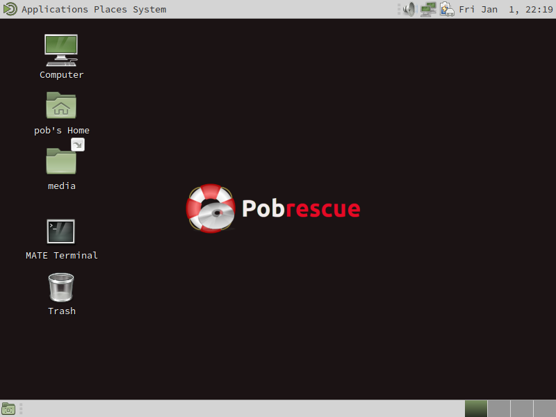

# Pobrescue
Pobrescue is a Linux live system rescue disk . It's based on ArchLinux Linux.

[**Download a iso**](http://www.freemedialab.org/listing/pobrescue/iso/)

## Docs
[Make a usb bootable media](docs/pobrescue_on_usb.md)

## Info

To connect to network type "nmtui"

To become root type "sudo -i"
To assign a password for the root user type: "sudo passwd"
The password for the root user is "pob"
The password for the pob user is "pob"
The vnc password is "pob123". You can change with "vncpasswd"

## Enabled Services

Openssh
Tigervnc
VsFtpd
NetworkManager

## Applications and Features:

Purpose| Packages
------------ | -------------
Diagnostics| Memtest, Gsmartcontrol, Smartmontools
Network| Network-manager, OpenSsh, Vsftpd(started at boot),Sshfs,Samba, Curl, Wget;
Burning disk| Wodim, Growisofs, Brasero  
Automount| Disks are automounted in /media 
Antivirus| Clamav; 
Backup| Rsync,Grsync,Rclone dd, Partimage, Clonezilla 
Data recovery| Testdisk, Photorec 
Partition manager| Gparted, Fdisk 
File manager| Midnight Commander, Caja 
Text Editor| Nano, Pluma
Web Browser| Midori, Elinks
Xterm| Mate Terminal 
Programming languages| Perl, Python, Bash 

## Screenshots
 

## Customize the iso
If you want to customize the iso, read https://wiki.archlinux.org/index.php/Archiso .

