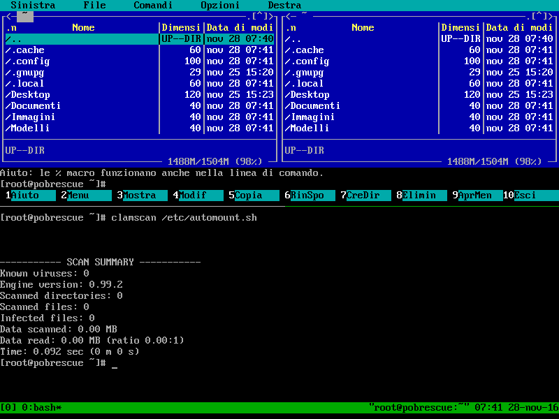

# Pobrescue
Pobrescue is a Linux live system rescue disk . It's based on ArchLinux Linux.

[**Download a iso**](http://www.freemedialab.org/listing/pobrescue/iso/)

## Docs
[Make a usb bootable media](docs/pobrescue_on_usb.md)

## Applications and Features:

Purpose| Packages
------------ | -------------
Diagnostics| Memtest, Gsmartcontrol, Smartmontools
Network| Network-manager, Open Ssh(started at boot),Sshfs,Samba, Curl, Wget;
Burning disk| Wodim, Growisofs, Brasero  
Automount| Disk are automounted in /media 
Antivirus| Clamav; 
Backup| Rsync,Grsync, dd, Partimage, Clonezilla 
Data recovery| Testdisk, Photorec 
Partition manager| Gparted, Fdisk 
File manager| Midnight Commander, Spacefm 
Text Editor| Nano, Pluma
Web Browser| Midori, Elinks
Xterm| Sakura, Xterm 
Programming languages| Perl, Python, Bash 

## Screenshots
 

## Customize the iso
If you want to customize the iso, read https://wiki.archlinux.org/index.php/Archiso .

